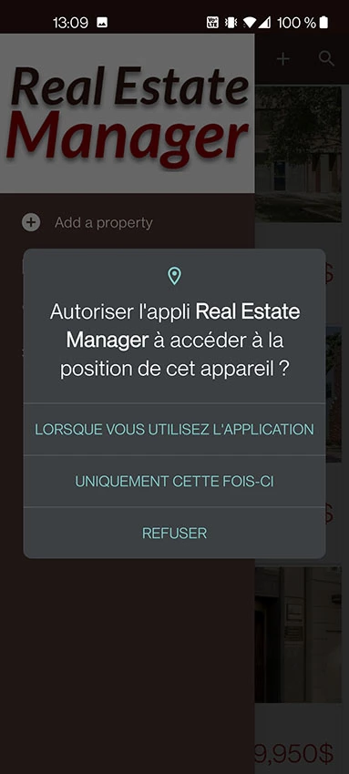
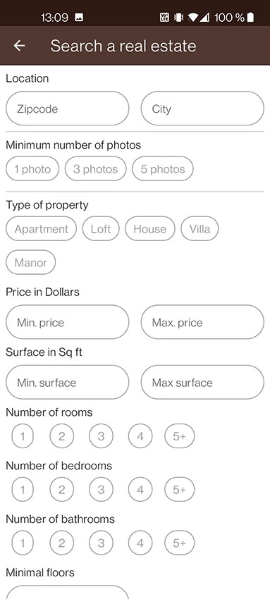

# Real Estate Manager

An android application which allows a real estate agent to quickly consult all the properties he owns under mandate.

## Description

This app is developped in Java.  

Training for use :

    - Room and SQLite
    - ViewBinding
    - GoogleMap
    - Navigation component (single activity)
    - SnapHelper
    - ExoPlayer
    - Different UI according to the device form factor and orientation
    - ContentProvider
    - Lifecycle / LiveData / ViewModel
    - MVVM

## Features

    - See all the properties stored in local database in a list with primary information
    - See a details screen with all the property's information and its location on a map
    - Add a property within the app in the local database
    - Edit a property within the app
    - Add photos and videos to illustrated a property
    - Search properties according to different criteria and see them in a list
    - Convert areas in square meters or square feet
    - Convert prices in Dollars or Euros

## Run on

After downloading or clone the repository, you need to create a new project in Google Cloud Platform (think to restrict your apikey with your SHA-1 and the correct API).

In Google Cloud Platform you have to activate :

    -Google Map

Add your google platform apikey in :

    - realestatemanager/gradle.properties
      - GOOGLE_MAPS_API_KEY="xxxxxxxxxxxxxxxxxxxxxx"

## Documentation

You can find a french documentation video  at :

    - assets/documentation/demo.mp4
[Go to documentation](https://github.com/Benlefevre/RealEstateManager/blob/master/assets/documentation/demo.mp4)

## Screenshots

### Home screen

### Details screen

### Fullscreen

### Edit screen

### Add screen

### Media permissions

### Dialog media choice

### Dialog media source

### Dialog save media

### Drawer

### Location permissions Dialog

### Map screen

### Search screen

### Settings screen

